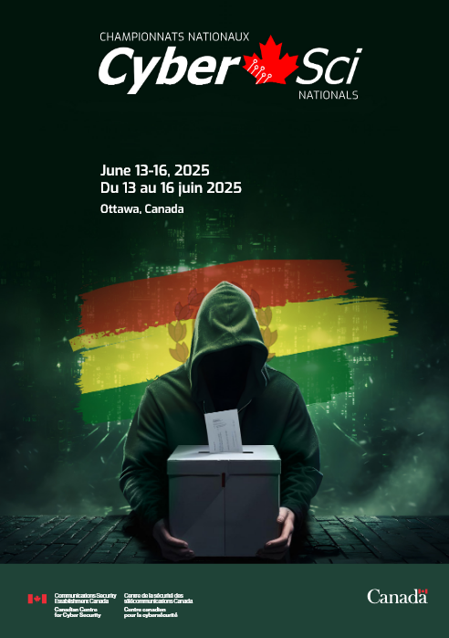

## CyberSci Nationals 2024/25

Challenges in this repo are for [CyberSci Nationals 2024/25](https://ctftime.org/event/2689) competition.

### Jeopardy

| Name | Category | Author |
| :--- | :---: | :---: |
| [Mixed Messaging](jeopardy/forensics/MixedMessaging) | Forensics | @ES |
| [Search Party](jeopardy/forensics/SearchParty) | Forensics | @ES |
| [There Will Be Signs](jeopardy/forensics/ThereWillBeSigns) | Forensics | @ES |
| [Rigged Ballot Location](jeopardy/osint/RiggedBallotLocation) | OSINT | @Shadow |
| [Rigged Ballots](jeopardy/re/RiggedBallots) | RE | @Shadow |
| [Voting Machine](jeopardy/re/voting-machine) | RE | @0xd13a |
| [Vibe Management](jeopardy/web/vibe-management) | Web/Cloud | @jacksimple |
| [Unauthorized App 1](jeopardy/mobile/UnauthorizedAndroidApp1) and [Unauthorized App 2](jeopardy/mobile/UnauthorizedAndroidApp2) | Mobile | @Ch0ufleur |
| [staged](jeopardy/crypto/staged/README.md) | Crypto | @iamsilk |
| [256](jeopardy/crypto/256/README.md) | Crypto | @iamsilk |
| [dot dot dot](jeopardy/crypto/dot_dot_dot/README.md) | Crypto | @iamsilk |
| [4096](jeopardy/crypto/4096/README.md) | Crypto | @iamsilk |
| [private voting](jeopardy/crypto/private_voting/README.md) | Crypto | @iamsilk |
|  [A Scanner Pwnly](jeopardy/web/a_scanner_pwnly) | Web/Cloud | @enderthenetrunner |
| [Misprotected](jeopardy/re/misprotected/README.md) | @RE | @k4yt3x |
| [Open Sesame](jeopardy/pwn/open_sesame) | Pwn | @raed_f |
| [By The Power of the key, open!](jeopardy/pwn/by_the_power) | Pwn | @Willem |
| [History stealer](jeopardy/web/history-stealer) | Web | @0xHamy |
| Badge | Hardware | @t1v0 |
| [my campaign pal](jeopardy/web/my-campaign-pal) | AI | @jacksimple |

### Defence

| Name | Author |
| :--- | :---: |
| [Vote Tabulation System](defence/vts) | @0xd13a |
| [Realtime Election Map](defence/electomap) | @enderthenetrunner |
| [Candidate registry](defence/candidate_registry) | @trenth |
| [Voter registry](defence/voter_registry) | @iamsilk |

## Backstory

> Your team of security experts has demonstrated exceptional skill in defending Val Verde during this critical electoral campaign. Attacks were thwarted, vulnerabilities patched, and perpetrators brought to justice.
>
> But while you’ve won this battle, the war is far from over.
>
> Our latest intelligence confirms that Val Verde’s enemies are preparing an even greater offensive for National Election Day in June. Every aspect of the electoral infrastructure—voter registries, voting machines, ballot tallying systems—will be under relentless attack.
>
> Once again, the people of Val Verde are counting on you to safeguard the integrity of their election. It’s time to roll up your sleeves and get to work.
> Good luck! The nation is depending on you.